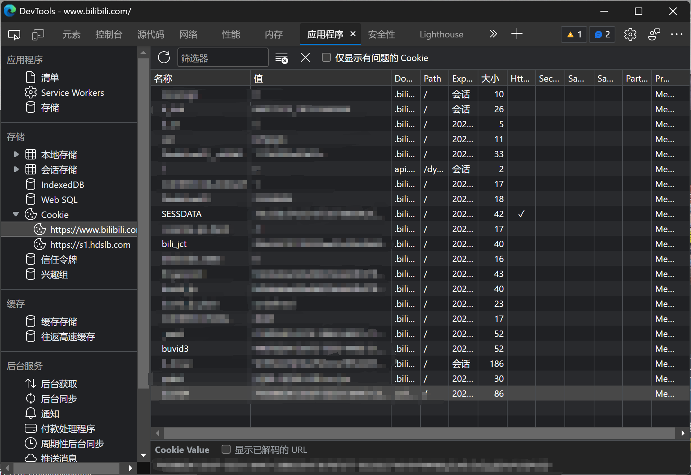

# 获取认证信息

一些操作（如视频点赞）需要使用 cookie 中的认证信息，获取信息步骤如下：

1. 打开[哔哩哔哩主页](https://www.bilibili.com)，登陆账号

2. 按 F12 打开开发人员工具，进入应用程序页（浏览器间存在差异，也可能是网页存储等），打开 Cookie 栏，记录 `SESSDATA`, `bili_jct`, `buvid3` 后的值备用（以 Edge 为例，如下图）



3. 实例化 `BiliCredential` 类并传入，以 `BiliVideo` 为例：

```csharp
var credential = new BiliCredential
{
    SessData = "<SESSDATA 值>",
    BiliJct = "<bili_jct> 值",
    Buvid3 = "<buvid3 值>",
};

var video = new BiliVideo(170001, credential);
```

**注意：请妥善保存数据，一旦泄露，他人可以轻易使用这些数据登录你的账号，并伪装你进行操作！**
